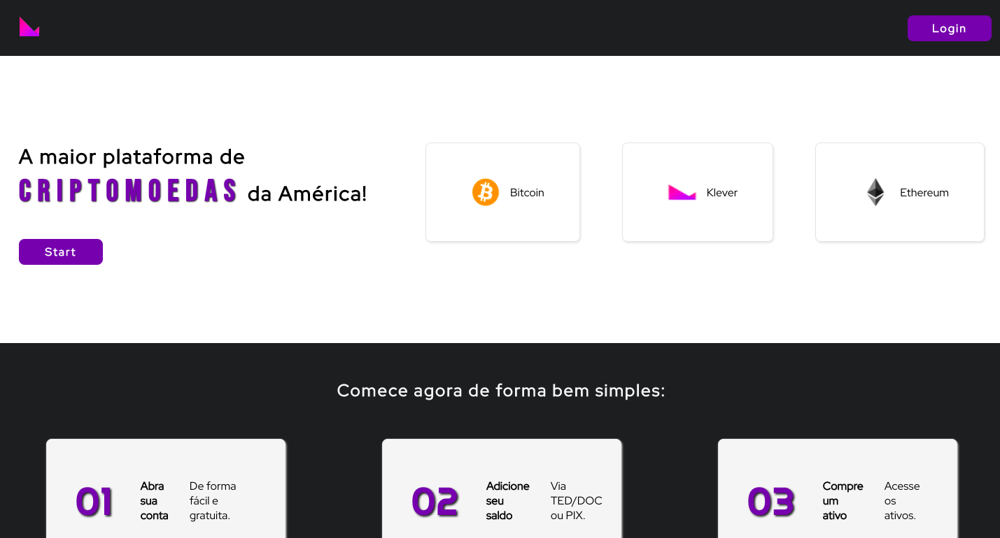
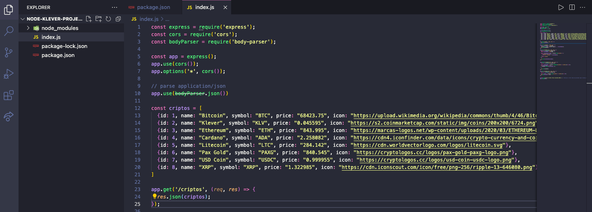
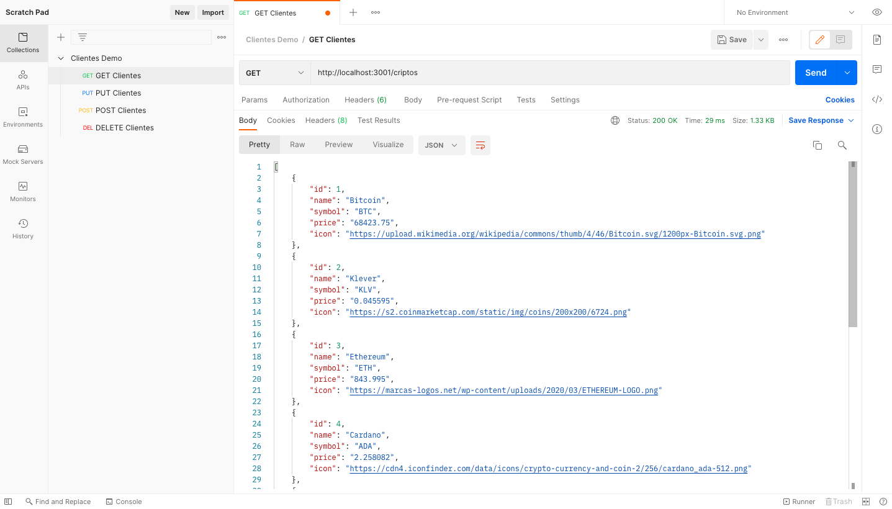

# Klever Project

Projeto desenvolvido para processo seletivo na [Klever](https://klever.io).

## :bookmark_tabs: Sobre o projeto:

Nesse projeto foi desenvolvido um CRUD (Create, Read, Update, Delete) através de uma interface que simula um site de Blockchain e Criptomoedas. Foram utilizadas tecnologias como React, Redux e SCSS.
Os testes foram criados com a React Testing Library utilizando também o framework Jest.

## :scroll: Regras do negócio:

O Desafio Técnico consiste em criar uma aplicação web que realiza um CRUD (Create, Read, Update, Delete).
Em seguida, a aplicação deve ser criada com React e deve consumir uma API simulada (Mock).

Requerimentos técnicos:
- :white_check_mark: Mantenha o código no Github
- :white_check_mark: Crie scripts de execução npm

Frontend:
- :white_check_mark: React
- :white_check_mark: Consumir a mock API
- :white_check_mark: Validar os inputs
- :white_check_mark: Usar Redux para manutenção dos estados

Extra:
- :white_check_mark: Usar Hooks
- :white_check_mark: Usar Mocha/Jest para realizar testes de integração

## :open_book: Informações

#### :rocket: Execução

`npm start`
> Iniciar aplicação através do app.js, nota: Antes de entrar no html servido pela pasta public, rode o comando npm run build para a versão mais recente em produção 

`npm run dev`
> Para rodar o projeto localmente, nele antes é inicilizado o server no arquivo app, e logo em seguido o servidor referente ao ambiente de desenvolvimento.

`npm run build`
> Compila o código em desenvolvimento para ser servido na pasta public

#### 📓 Soluções adotadas e informações

Utilizei **React** para o desenvolvimento da aplicação web.

Utilizei **NodeJs** para o desenvolvimento da API que foi utilizada e consumida no projeto. Junto com o NodeJs, utilizei o framework **Express** para a criação das rotas no backend.

Foi utilizado o **Postman** para verificar se as rotas estavam em pleno funcionamento para gerar o JSON vindo da API.

Para a parte de _gerenciamento de estado da aplicação_, optei pela implementação com **Redux Toolkit** prevendo _escalabilidade_ na aplicação, pois features novas sempre irão surgir.

A aplicações consistem da tela inicial, onde criei uma `Homepage` simulando um site de Blockchain e Criptomoedas, onde uma das sessões é alimentada pela API que criei para esse projeto. Temos também uma página de `Login` para o usuário cadastrar seu nome e e-mail para poder ter acesso a página de ativos, que é a `Carteira`. Para o controle dessas rotas, utilizo o `react-router-dom`.

Extensões utilizadas que auxiliam a visualização de props do React e de disparo de actions do Redux:

- [React Developer Tools](https://chrome.google.com/webstore/detail/react-developer-tools/fmkadmapgofadopljbjfkapdkoienihi)
- [Redux DevTools](https://chrome.google.com/webstore/detail/redux-devtools/lmhkpmbekcpmknklioeibfkpmmfibljd?hl=pt-BR)

Para visualização da performance do site é utilizado o [Lighthouse](https://developers.google.com/web/tools/lighthouse?hl=pt-br)

#### :gear: Tecnologias utilizadas

1. [React](https://pt-br.reactjs.org/): Utilizado React para criação da interface da aplicação web.
1. [Redux](https://redux.js.org/): Para gerenciamento de estado da aplicação.
2. [NodeJs](https://nodejs.org/en/): Para criação da API.
3. [SCSS](https://sass-lang.com/): Para estilização de todo o projeto.
6. [react-router-dom](https://reactrouter.com/web/api/): Para gereciamento de rotas na aplicação.
7. [RTL](https://testing-library.com/docs/react-testing-library/intro/): Para testes na aplicação
8. [Eslint](https://eslint.org/): Para estilização e padronização com boas práticas de código

